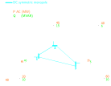

.. _csv_import:

CSV files for importing data
============================

In this page the column names for importing data from CSV files are described. It is important to note that column names are case sensitive. The CSV can then be used for the following functions:

.. py:function:: Create_grid_from_data(S_base, AC_node_data=None, AC_line_data=None, DC_node_data=None, DC_line_data=None, Converter_data=None, data_in='Real')
   :noindex:

   Creates a new grid from pandas/geopandas DataFrames or csv file strings containing component data.

.. py:function:: Extend_grid_from_data(grid, AC_node_data=None, AC_line_data=None, DC_node_data=None, DC_line_data=None, Converter_data=None, data_in='Real')
   :noindex:

   Extends an existing grid with new components from pandas/geopandas DataFrames or csv file strings.

   Case 5 Stagg Grid

The examples below are based on the Case 5 Stagg Grid in MATACDC [1]_.

Required CSV Files
-------------------

Select your data input format:

Data in per unit (pu)
^^^^^^^^^^^^^^^^^^^^^^

.. raw:: html

   

   
<b>Data in per unit (pu)</b>

.. list-table:: AC Nodes
   :widths: 20 20 20
   :header-rows: 1

   * - Variable
     - Column Name
     - Default Value
   * - Node ID
     - Node_id
     - Required
   * - Type
     - type
     - PQ
   * - Base Voltage (kV)
     - kV_base
     - Required
   * - Initial Voltage (pu)
     - Voltage_0
     - 1.01
   * - Initial Angle (rad)
     - theta_0
     - 0.01
   * - Generation Power (pu)
     - Power_Gained
     - 0
   * - Generation Reactive (pu)
     - Reactive_Gained
     - 0
   * - Load Power (pu)
     - Power_load
     - 0
   * - Load Reactive (pu)
     - Reactive_load
     - 0
   * - Min Voltage (pu)
     - Umin
     - 0.9
   * - Max Voltage (pu)
     - Umax
     - 1.1
   * - X Coordinate
     - x_coord
     - None
   * - Y Coordinate
     - y_coord
     - None
   * - Shunt Susceptance (pu)
     - Bs
     - 0
   * - Shunt Conductance (pu)
     - Gs
     - 0
   * - Geometry
     - geometry
     - None

.. list-table:: AC Branch
   :widths: 20 20 20
   :header-rows: 1

   * - Description
     - Column Name
     - Default Value
   * - Line ID
     - Line_id
     - Required
   * - From Node
     - fromNode
     - Required
   * - To Node
     - toNode
     - Required
   * - Resistance (pu)
     - r
     - 0.00001
   * - Reactance (pu)
     - x
     - 0.00001
   * - Conductance
     - g
     - 0
   * - Susceptance
     - b
     - 0
   * - MVA Rating
     - MVA_rating
     - S_base*1.05
   * - Length
     - Length_km
     - 1
   * - Transformer Ratio
     - m
     - 1
   * - Phase Shift
     - shift
     - 0
   * - Geometry
     - geometry
     - None

.. list-table:: DC Nodes
   :widths: 20 20 20
   :header-rows: 1

   * - Variable
     - Column Name
     - Default Value
   * - Node ID
     - Node_id  
     - Required 
   * - Node Type
     - type
     - P
   * - Base Voltage (kV)
     - kV_base
     - Required
   * - Initial Voltage (pu)
     - Voltage_0
     - 1.01
   * - Active Power Generation (pu)
     - Power_Gained
     - 0
   * - Active Power Load (pu)
     - Power_Load
     - 0
   * - Minimum Voltage (pu)
     - Umin
     - 0.95
   * - Maximum Voltage (pu)
     - Umax
     - 1.05
   * - X Coordinate
     - x_coord
     - None
   * - Y Coordinate
     - y_coord
     - None
   * - Geometry
     - geometry
     - None

.. list-table:: DC Branch
   :widths: 20 20 20
   :header-rows: 1

   * - Description
     - Column Name
     - Default Value
   * - Line ID
     - Line_id
     - Required
   * - From Node
     - fromNode
     - Required
   * - To Node
     - toNode
     - Required
   * - Resistance (pu)
     - r
     - 0.0001
   * - MVA Rating
     - MVA_rating
     - 99999
   * - Length (km)
     - Length_km
     - 1
   * - Mono/Bi-Polar (m/sm/b)
     - Mono_Bi_polar
     - m
   * - Number of parallel branches
     - N_cables
     - 1
   * - Geometry
     - geometry
     - None

.. list-table:: Converter
   :widths: 20 20 20
   :header-rows: 1

   * - Description
     - Column Name
     - Default Value    
   * - Converter ID
     - Conv_id
     - Required
   * - AC node
     - AC_node
     - Required
   * - DC node
     - DC_node
     - Required
   * - AC Type
     - AC_type
     - Takes type from AC node
   * - DC Type
     - DC_type
     - Takes type from DC node
   * - Active Power AC setpoint (pu)
     - P_AC
     - 0
   * - Reactive Power AC setpoint (pu)
     - Q_AC
     - 0
   * - Active Power DC setpoint (pu)
     - P_DC
     - 0
   * - Transformer Resistance (pu)
     - T_r
     - 0
   * - Transformer Reactance (pu)
     - T_x
     - 0
   * - Phase Reactor Resistance (pu)
     - PR_r
     - 0
   * - Phase Reactor Reactance (pu)
     - PR_x
     - 0
   * - Filter Susceptance (pu)
     - Filter_b
     - 0
   * - Droop coefficient
     - Droop
     - 0
   * - AC Base Voltage (kV)
     - AC_kV_base
     - Takes from AC node
   * - MVA Rating
     - MVA_rating
     - 99999
   * - Minimum Voltage (pu)
     - Ucmin
     - 0.85
   * - Maximum Voltage (pu)
     - Ucmax
     - 1.2
   * - Number of converters
     - Nconverter
     - 1
   * - Polarity
     - pol
     - 1
   * - Geometry
     - geometry
     - None

Here are example CSV files from a 5-bus test system in per unit:

**AC Node Data (AC_node_data.csv)**

.. code-block:: text

    Node_id, type  , Voltage_0, theta_0, Power_Gained, Reactive_Gained, Power_load, Reactive_load, kV_base
    1     , Slack , 1.06     , 0      , 0           , 0              , 0         , 0            , 345
    2     , PV    , 1        , 0.1    , 0.4         , 0              , 0.2       , 0.1          , 345  
    3     , PQ    , 1        , 0.1    , 0           , 0              , 0.45      , 0.15         , 345
    4     , PQ    , 1        , 0.1    , 0           , 0              , 0.4       , 0.05         , 345
    5     , PQ    , 1        , 0.1    , 0           , 0              , 0.6       , 0.1          , 345

**AC Line Data (AC_line_data.csv)**

.. code-block:: text

    Line_id, fromNode, toNode,r    , x    , g, b   ,MVA_rating, kV_base
    1      , 1       , 2     , 0.02, 0.06 , 0, 0.06, 150      , 345
    2      , 1       , 3     , 0.08, 0.24 , 0, 0.05, 100      , 345  
    3      , 2       , 3     , 0.06, 0.18 , 0, 0.04, 100      , 345
    4      , 2       , 4     , 0.06, 0.18 , 0, 0.04, 100      , 345
    5      , 2       , 5     , 0.04, 0.12 , 0, 0.03, 100      , 345
    6      , 3       , 4     , 0.01, 0.03 , 0, 0.02, 100      , 345
    7      , 4       , 5     , 0.08, 0.24 , 0, 0.05, 100      , 345

**DC Node Data (DC_node_data.csv)**

.. code-block:: text

    Node_id,type ,Voltage_0,Power_Gained,Power_load,kV_base
       1   , P   ,     1   ,     0      ,     0    , 345
       2   ,Slack,     1   ,     0      ,     0    , 345
       3   , P   ,     1   ,     0      ,     0    , 345

**DC Line Data (DC_line_data.csv)**

.. code-block:: text

    Line_id, fromNode, toNode, r    , MW_rating, kV_base, Mono_Bi_polar
    1      , 1       , 2     , 0.052, 100     , 345    , sm
    2      , 2       , 3     , 0.052, 100     , 345    , sm
    3      , 1       , 3     , 0.073, 100     , 345    , sm

**Converter Data (Converter_data.csv)**

.. code-block:: text

    Conv_id, AC_type, DC_type, AC_node, DC_node, P_AC  , Q_AC , P_DC, T_r   , T_x  , PR_r  , PR_x   , Filter_b, Droop, AC_kV_base, MVA_rating, Ucmin, Ucmax
    1      , PQ     , PAC    , 2      , 1      , -0.6  , -0.4 , 0   , 0.0015, 0.121, 0.0001, 0.16428, 0.0887, 0    , 345       , 120       , 0.9  , 1.2
    2      , PV     , Slack  , 3      , 2      , 0     , 0    , 0   , 0.0015, 0.121, 0.0001, 0.16428, 0.0887, 0    , 345       , 120       , 0.9  , 1.2
    3      , PQ     , PAC    , 5      , 3      , 0.35  , 0.05 , 0   , 0.0015, 0.121, 0.0001, 0.16428, 0.0887, 0    , 345       , 120       , 0.9  , 1.2

**Example Code**

.. code-block:: python

    import pandas as pd
    import pyflow_acdc as pyf

    # Read CSV files
    ac_nodes = pd.read_csv('AC_node_data.csv')
    ac_lines = pd.read_csv('AC_line_data.csv')
    dc_nodes = pd.read_csv('DC_node_data.csv')
    dc_lines = pd.read_csv('DC_line_data.csv')
    converters = pd.read_csv('Converter_data.csv')

    # Create grid
    grid, results = pyf.Create_grid_from_data(
        S_base=100,
        AC_node_data=ac_nodes,
        AC_line_data=ac_lines,
        DC_node_data=dc_nodes,
        DC_line_data=dc_lines,
        Converter_data=converters,
        data_in='pu'  # Data is in per unit
    )

.. raw:: html

   

Data in Ohms
^^^^^^^^^^^^^^  

.. raw:: html
  
   

   
<b>Data in Ohms</b>

Data in Ohms affects AC and DC branch components, where the user specifies the absolute resistance. It is assumed that the user has taken into account length, parallel branches and so on. And the resistance, reactance, conductance and susceptance are given for the whole branch.

**AC Node Data (AC_node_data_Ohm.csv)**

.. list-table:: AC Nodes
   :widths: 20 20 20
   :header-rows: 1

   * - Description
     - Column Name
     - Default Value
   * - Node ID
     - Node_id
     - Required
   * - Node Type
     - type
     - PQ
   * - Base Voltage (kV)
     - kV_base
     - Required
   * - Initial Voltage (pu)
     - Voltage_0
     - 1.01
   * - Initial Angle (rad)
     - theta_0
     - 0.01
   * - Active Power Generation (MW)
     - Power_Gained
     - 0
   * - Reactive Power Generation (MVAR)
     - Reactive_Gained
     - 0
   * - Active Power Load (MW)
     - Power_load
     - 0
   * - Reactive Power Load (MVAR)
     - Reactive_load
     - 0
   * - Minimum Voltage (pu)
     - Umin
     - 0.9
   * - Maximum Voltage (pu)
     - Umax
     - 1.1
   * - X Coordinate
     - x_coord
     - None
   * - Y Coordinate
     - y_coord
     - None
   * - Shunt Susceptance
     - Bs
     - 0
   * - Shunt Conductance
     - Gs
     - 0
   * - Geometry
     - geometry
     - None

**AC Line Data (AC_line_data_Ohm.csv)**

.. list-table:: AC Branch
   :widths: 20 20 20
   :header-rows: 1

   * - Description
     - Column Name
     - Default Value
   * - Line ID
     - Line_id
     - Required
   * - From Node
     - fromNode
     - Required
   * - To Node
     - toNode
     - Required
   * - Resistance (Ω)
     - R
     - 0.0001
   * - Reactance (Ω)
     - X
     - 0.0001
   * - Conductance (S)
     - G
     - 0
   * - Susceptance (S)
     - B
     - 0
   * - MVA Rating
     - MVA_rating
     - 99999
   * - Length (km)
     - Length_km
     - 1
   * - Transformer Ratio
     - m
     - 1
   * - Phase Shift (rad)
     - shift
     - 0
   * - Geometry
     - geometry
     - None
            
**DC Node Data (DC_node_data_Ohm.csv)**

.. list-table:: DC Nodes
   :widths: 20 20 20
   :header-rows: 1

   * - Variable
     - Column Name
     - Default Value
   * - Node ID
     - Node_id  
     - Required 
   * - Node Type
     - type
     - P
   * - Base Voltage (kV)
     - kV_base
     - Required
   * - Initial Voltage (pu)
     - Voltage_0
     - 1.01
   * - Active Power Generation (MW)
     - Power_Gained
     - 0
   * - Active Power Load (MW)
     - Power_Load
     - 0
   * - Minimum Voltage (pu)
     - Umin
     - 0.95
   * - Maximum Voltage (pu)
     - Umax
     - 1.05
   * - X Coordinate
     - x_coord
     - None
   * - Y Coordinate
     - y_coord
     - None
   * - Geometry
     - geometry
     - None

**DC Line Data (DC_line_data_Ohm.csv)**

.. list-table:: DC Branch
   :widths: 20 20 20
   :header-rows: 1

   * - Description
     - Column Name
     - Default Value
   * - Line ID
     - Line_id
     - Required
   * - From Node
     - fromNode
     - Required
   * - To Node
     - toNode
     - Required
   * - Resistance (Ω)
     - R
     - 0.0095*km
   * - Length (km)
     - Length_km
     - 1
   * - Mono/Bi-Polar (m/sm/b)
     - Mono_Bi_polar
     - m
   * - Number of parallel branches
     - N_cables
     - 1
   * - Geometry
     - geometry
     - None

**Converter Data (Converter_data_Ohm.csv)**

.. list-table:: Converter
   :widths: 20 20 20
   :header-rows: 1

   * - Description
     - Column Name
     - Default Value    
   * - Converter ID     
     - Conv_id
     - Required
   * - AC node
     - AC_node
     - Required
   * - DC node
     - DC_node
     - Required
   * - AC Type
     - AC_type
     - Takes type from AC node  
   * - DC Type
     - DC_type
     - Takes type from DC node
   * - Active Power AC setpoint (MW)
     - P_MW_AC
     - 0
   * - Reactive Power AC setpoint (MVAR)
     - Q_AC
     - 0
   * - Active Power DC setpoint (MW)
     - P_MW_DC
     - 0    
   * - Transformer Resistance (Ω)
     - T_R_Ohm
     - 0
   * - Transformer Reactance (mH)
     - T_X_mH
     - 0
   * - Phase Reactor Resistance (Ω)
     - PR_R_Ohm
     - 0
   * - Phase Reactor Reactance (mH)
     - PR_X_mH
     - 0
   * - Filter Susceptance (μS)
     - Filter_uF
     - 0
   * - Droop coefficient
     - Droop
     - 0
   * - AC Base Voltage (kV)
     - AC_kV_base
     - Takes from AC node
   * - MVA Rating
     - MVA_rating
     - 99999
   * - Minimum Voltage (pu)
     - Ucmin
     - 0.85
   * - Maximum Voltage (pu)
     - Ucmax
     - 1.2
   * - Number of converters
     - Nconverter
     - 1
   * - Polarity
     - pol
     - 1
   * - Geometry 
     - geometry
     - None

**Example CSV Files**

Here are example CSV files from a 5-bus test system using the data in Ohm values:

**AC Node Data (AC_node_data_Ohm.csv)**

.. code-block:: text

    Node_id,type,Voltage_0,theta_0,Power_Gained,Reactive_Gained,Power_load,Reactive_load,kV_base
    1,Slack,1.06,0,0,0,0,0,345
    2,PV,1,0.1,40,0,20,10,345
    3,PQ,1,0.1,0,0,45,15,345
    4,PQ,1,0.1,0,0,40,5,345
    5,PQ,1,0.1,0,0,60,10,345

**AC Line Data (AC_line_data_Ohm.csv)**

.. code-block:: text

    Line_id,fromNode,toNode,R,X,G,B,MVA_rating,kV_base
    1,1,2,23.810,71.420,0,0.0000504,150,345
    2,1,3,95.220,285.660,0,0.0000420,100,345
    3,2,3,71.420,214.250,0,0.0000336,100,345
    4,2,4,71.420,214.250,0,0.0000336,100,345
    5,2,5,47.610,142.830,0,0.0000252,100,345
    6,3,4,11.900,35.710,0,0.0000168,100,345
    7,4,5,95.220,285.660,0,0.0000420,100,345

**DC Node Data (DC_node_data_Ohm.csv)**

.. code-block:: text

    Node_id,type,Voltage_0,Power_Gained,Power_load,kV_base
    1,P,1,0,0,345
    2,Slack,1,0,0,345
    3,P,1,0,0,345

**DC Line Data (DC_line_data_Ohm.csv)**

.. code-block:: text

    Line_id,fromNode,toNode,R,MW_rating,kV_base,Mono_Bi_polar
    1,1,2,61.89,100,345,sm
    2,2,3,61.89,100,345,sm
    3,1,3,86.89,100,345,sm

**Converter Data (Converter_data_Ohm.csv)**

.. code-block:: text

    Conv_id,AC_type,DC_type,AC_node,DC_node,P_MW_AC,Q_MVA_AC,P_MW_DC,T_R,T_X,PR_R,PR_X,Filter,Droop,AC_kV_base,MVA_rating,Ucmin,Ucmax
    1,PQ,PAC,2,1,-60,-40,0,1.785,144.02,0.119,195.534,7.45E-05,0,345,120,0.9,1.2
    2,PV,Slack,3,2,0,0,0,1.785,144.02,0.119,195.534,7.45E-05,0,345,120,0.9,1.2
    3,PQ,PAC,5,3,35,5,0,1.785,144.02,0.119,195.534,7.45E-05,0,345,120,0.9,1.2

**Example Code**

.. code-block:: python

    import pandas as pd
    import pyflow_acdc as pyf

    # Read CSV files
    ac_nodes = pd.read_csv('AC_node_data_Ohm.csv')
    ac_lines = pd.read_csv('AC_line_data_Ohm.csv')
    dc_nodes = pd.read_csv('DC_node_data_Ohm.csv')
    dc_lines = pd.read_csv('DC_line_data_Ohm.csv')
    converters = pd.read_csv('Converter_data_Ohm.csv')

    # Create grid
    grid, results = pyf.Create_grid_from_data(
        S_base=100,
        AC_node_data=ac_nodes,
        AC_line_data=ac_lines,
        DC_node_data=dc_nodes,
        DC_line_data=dc_lines,
        Converter_data=converters,
        data_in='Ohm'  # Data is in Ohm values
    )

.. raw:: html

   

Data in Real values
^^^^^^^^^^^^^^^^^^^^

.. raw:: html 

   

   
<b>Data in Real values</b>

.. list-table:: AC Nodes
   :widths: 20 20 20
   :header-rows: 1

   * - Description
     - Column Name
     - Default Value
   * - Node ID
     - Node_id
     - Required
   * - Node Type
     - type
     - PQ
   * - Base Voltage (kV)
     - kV_base
     - Required
   * - Initial Voltage (pu)
     - Voltage_0
     - 1.01
   * - Initial Angle (rad)
     - theta_0
     - 0.01
   * - Active Power Generation (MW)
     - Power_Gained
     - 0
   * - Reactive Power Generation (MVAR)
     - Reactive_Gained
     - 0
   * - Active Power Load (MW)
     - Power_load
     - 0
   * - Reactive Power Load (MVAR)
     - Reactive_load
     - 0
   * - Minimum Voltage (pu)
     - Umin
     - 0.9
   * - Maximum Voltage (pu)
     - Umax
     - 1.1
   * - X Coordinate
     - x_coord
     - None
   * - Y Coordinate
     - y_coord
     - None
   * - Shunt Susceptance
     - Bs
     - 0
   * - Shunt Conductance
     - Gs
     - 0
   * - Geometry
     - geometry
     - None

.. list-table:: AC Branch
   :widths: 20 20 20
   :header-rows: 1

   * - Description
     - Column Name
     - Default Value
   * - Line ID
     - Line_id
     - Required
   * - From Node
     - fromNode
     - Required
   * - To Node
     - toNode
     - Required
   * - Resistance (Ω/km)
     - R_Ohm_km
     - Required
   * - Inductance (mH/km)
     - L_mH_km
     - Required
   * - Capacitance (μF/km)
     - C_uF_km
     - 0
   * - Conductance (μS/km)
     - G_uS_km
     - 0
   * - Current Rating (A)
     - A_rating
     - 9999
   * - Length
     - Length_km
     - 1
   * - Number of parallel branches
     - N_cables
     - 1
   * - Transformer Ratio
     - m
     - 1
   * - Phase Shift
     - shift
     - 0
   * - Geometry
     - geometry
     - None
.. list-table:: DC Nodes
   :widths: 20 20 20
   :header-rows: 1

   * - Variable
     - Column Name
     - Default Value
   * - Node ID
     - Node_id  
     - Required 
   * - Node Type
     - type
     - P
   * - Base Voltage
     - kV_base
     - Required
   * - Initial Voltage (pu)
     - Voltage_0
     - 1.01
   * - Active Power Generation (MW)
     - Power_Gained
     - 0
   * - Active Power Load (MW)
     - Power_Load
     - 0
   * - Minimum Voltage
     - Umin
     - 0.95
   * - Maximum Voltage
     - Umax
     - 1.05
   * - X Coordinate
     - x_coord
     - None
   * - Y Coordinate
     - y_coord
     - None
   * - Geometry
     - geometry
     - None

.. list-table:: DC Branch
   :widths: 20 20 20
   :header-rows: 1

   * - Description
     - Column Name
     - Default Value
   * - Line ID
     - Line_id
     - Required
   * - From Node
     - fromNode
     - Required
   * - To Node
     - toNode
     - Required
   * - Resistance (Ω/km)    
     - R_Ohm_km
     - 0.0095
   * - Current Rating (A)
     - A_rating
     - 9999
   * - Number of parallel branches
     - N_cables
     - 1
   * - Length (km)
     - Length_km
     - 1
   * - Polarity (m/sm/b)
     - Mono_Bi_polar
     - m
   * - Geometry
     - geometry
     - None
     
.. list-table:: Converter
   :widths: 20 20 20
   :header-rows: 1

   * - Description
     - Column Name
     - Default Value    
   * - Converter ID     
     - Conv_id
     - Required
   * - AC node
     - AC_node
     - Required
   * - DC node
     - DC_node
     - Required
   * - AC Type
     - AC_type
     - Takes type from AC node  
   * - DC Type
     - DC_type
     - Takes type from DC node
   * - Active Power AC setpoint (MW)
     - P_MW_AC
     - 0
   * - Reactive Power AC setpoint (MVAR)
     - Q_MVA_AC
     - 0
   * - Active Power DC setpoint (MW)
     - P_MW_DC
     - 0    
   * - Transformer Resistance (Ω)
     - T_R_Ohm
     - 0
   * - Transformer Reactance (mH)
     - T_X_mH
     - 0
   * - Phase Reactor Resistance (Ω)
     - PR_R_Ohm
     - 0
   * - Phase Reactor Reactance (mH)
     - PR_X_mH
     - 0
   * - Filter Susceptance (μS)
     - Filter_uF
     - 0
   * - Droop coefficient
     - Droop
     - 0
   * - AC Base Voltage (kV)
     - AC_kV_base
     - Takes from AC node
   * - MVA Rating
     - MVA_rating
     - 99999
   * - Minimum Voltage (pu)
     - Ucmin
     - 0.85
   * - Maximum Voltage (pu)
     - Ucmax
     - 1.2
   * - Number of converters
     - Nconverter
     - 1
   * - Polarity
     - pol
     - 1
   * - Geometry 
     - geometry
     - None

Here are example CSV files from a 5-bus test system using the data in Real values:

**AC Node Data (AC_node_data_Real.csv)**

.. code-block:: text

    Node_id,type,Voltage_0,theta_0,Power_Gained,Reactive_Gained,Power_load,Reactive_load,kV_base
    1,Slack,1.06,0,0,0,0,0,345
    2,PV,1,0.1,40,0,20,10,345
    3,PQ,1,0.1,0,0,45,15,345
    4,PQ,1,0.1,0,0,40,5,345
    5,PQ,1,0.1,0,0,60,10,345

**AC Line Data (AC_line_data_Real.csv)**

.. code-block:: text

    Line_id,fromNode,toNode,R_Ohm_km,L_mH_km,G_uS_km,C_uF_km,A_rating,kV_base
    1,1,2,23.81,227.3369207,0,0.160428183,251.0218562,345
    2,1,3,95.22,909.2840209,0,0.133690152,167.3479041,345
    3,2,3,71.42,681.9789311,0,0.106952122,167.3479041,345
    4,2,4,71.42,681.9789311,0,0.106952122,167.3479041,345
    5,2,5,47.61,454.6420104,0,0.080214091,167.3479041,345
    6,3,4,11.9,113.6684604,0,0.053476061,167.3479041,345
    7,4,5,95.22,909.2840209,0,0.133690152,167.3479041,345

**DC Node Data (DC_node_data_Real.csv)**

.. code-block:: text

    Node_id,type,Voltage_0,Power_Gained,Power_load,kV_base
    1,P,1,0,0,345
    2,Slack,1,0,0,345
    3,P,1,0,0,345

**DC Line Data (DC_line_data_Real.csv)**

.. code-block:: text

    Line_id,fromNode,toNode,R_Ohm_km,A_rating,kV_base,Mono_Bi_polar
    1,1,2,61.89,290,345,sm
    2,2,3,61.89,290,345,sm
    3,1,3,86.89,290,345,sm

**Converter Data (Converter_data_Real.csv)**

.. code-block:: text

    Conv_id,AC_type,DC_type,AC_node,DC_node,P_MW_AC,Q_MVA_AC,P_MW_DC,T_R_Ohm,T_X_mH,PR_R_Ohm,PR_X_mH,Filter_uF,Droop,AC_kV_base,MVA_rating,Ucmin,Ucmax
    1,PQ,PAC,2,1,-60,-40,0,1.785,458.4298981,0.119,622.4040529,0.237140865,0,345,120,0.9,1.2
    2,PV,Slack,3,2,0,0,0,1.785,458.4298981,0.119,622.4040529,0.237140865,0,345,120,0.9,1.2
    3,PQ,PAC,5,3,35,5,0,1.785,458.4298981,0.119,622.4040529,0.237140865,0,345,120,0.9,1.2

**Example Code**

.. code-block:: python

    import pandas as pd
    import pyflow_acdc as pyf

    # Read CSV files
    ac_nodes = pd.read_csv('AC_node_data_Real.csv')
    ac_lines = pd.read_csv('AC_line_data_Real.csv')
    dc_nodes = pd.read_csv('DC_node_data_Real.csv')
    dc_lines = pd.read_csv('DC_line_data_Real.csv')
    converters = pd.read_csv('Converter_data_Real.csv')

    # Create grid
    grid, results = pyf.Create_grid_from_data(
        S_base=100,
        AC_node_data=ac_nodes,
        AC_line_data=ac_lines,
        DC_node_data=dc_nodes,
        DC_line_data=dc_lines,
        Converter_data=converters,
        data_in='Real'  # Data is in Real values
    )

.. raw:: html

   

**References**

.. [1] J. Beerten and R. Belmans, "MatACDC - an open source software tool for steady-state analysis and operation of HVDC grids," 11th IET International Conference on AC and DC Power Transmission, Birmingham, 2015, pp. 1-9, doi: 10.1049/cp.2015.0061. keywords: {Steady-state analysis;HVDC grids;AC/DC systems;power flow modelling},

