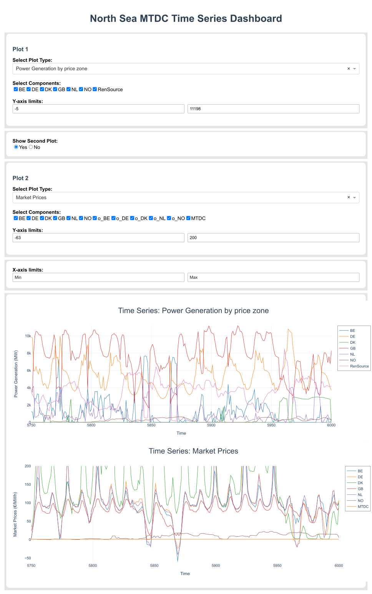

Dashboards
===========

For the use of this module, you need to have the optional dependendency pyflow_acdc[Dash] installed.

Interactive Dashboard
^^^^^^^^^^^^^^^^^^^^^^

For now you have to run the time series to have results to plot. Then run the dashboard. Once the dashboard is running, you can see the plots by selecting the desired plot type. And choose axis limits to zoom in or out.

.. py:function:: run_dash(grid)

   Creates and runs an interactive Dash web application for visualizing time series results.

   .. list-table::
      :widths: 20 10 50 10
      :header-rows: 1

      * - Parameter
        - Type
        - Description
        - Default
      * - ``grid``
        - Grid
        - Grid with time series results
        - Required

   **Features**:

   - Interactive plot selection:

     - Power Generation by price zone
     - Power Generation by generator
     - Power Generation by price zone (area chart)
     - Power Generation by generator (area chart)
     - Market Prices
     - AC line loading
     - DC line loading
     - AC/DC Converters
     - Curtailment
   - Dynamic axis limits
   - Component selection checklist
   - Real-time plot updates

 

Once the dashboard is created, you can see it in your browser under the url:

.. code-block:: bash

   http://127.0.0.1:8050/

.. code-block:: python

    import pyflow_acdc as pyf
    import pandas as pd
    [grid,results] = pyf.NS_MTDC()

    start = 5750
    end = 6000
    obj = {'Energy_cost': 1}

    market_prices_url = "https://raw.githubusercontent.com/BernardoCV/pyflow_acdc/bcv_dev/examples/NS_MTDC_TS/NS_TS_marketPrices_data_sd2024.csv"
    TS_MK = pd.read_csv(market_prices_url)
    pyf.add_TimeSeries(grid,TS_MK)

    wind_load_url = "https://raw.githubusercontent.com/BernardoCV/pyflow_acdc/bcv_dev/examples/NS_MTDC_TS/NS_TS_WL_data2024.csv"
    TS_wl = pd.read_csv(wind_load_url)
    pyf.add_TimeSeries(grid,TS_wl)

    times=pyf.TS_ACDC_OPF(grid,start,end,ObjRule=obj)  

    pyf.run_dash(grid)

   Example of the Dash dashboard.

