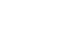

.. _modelling:

System Modelling 
================

This page presents the modelling of the different components of the grid.

The Classes are found in pyflow_acdc.Classes

AC System Modelling
-------------------

.. _AC_node_modelling:

AC node
^^^^^^^

.. figure:: ../images/AC_node_model.svg
   :width: 250
   :alt: AC node model
   :align: center

   AC node equivalent circuit with voltage source and impedance

The active and reactive power injections at the AC node are given by [1]_:

.. math::
    :label: eq:PnodeAC

    \begin{align}
      P_{net}^{ac} &= P_{flow}^{ac} \\
      P_{net}^{ac} &= \sum P_{g_i} +  \sum \gamma_{rg_i}P_{rg_i} - P_{l_i} + \sum P_{cn_i} \\
      P_{flow}^{ac} &= \sum_{k \in \mathcal{N}_{ac}} |V_i||V_k| [ G_{ik} \cos(\theta_i-\theta_k) + B_{ik} \sin(\theta_i-\theta_k) ] \qquad \forall i \in \mathcal{N}_{ac} 
    \end{align}

.. math::
    :label: eq:QnodeAC

    \begin{align}
      Q_{net}^{ac} &= Q_{flow}^{ac} \\
      Q_{net}^{ac} &=  \sum Q_{g_i} + \sum Q_{rg_i} -Q_{l_i}+\sum Q_{cn_{i}} \\
      Q_{flow}^{ac} &= \sum_{k \in \mathcal{N}_{ac}} |V_i||V_k|[G_{ik} \sin(\theta_i-\theta_k)-B_{ik} \cos(\theta_i-\theta_{k})] \qquad \forall i \in \mathcal{N}_{ac} 
    \end{align}

.. math::
    :label: eq:Vac

    \begin{align}
        V_{min} \leq V_{i} \leq V_{max}  & \qquad \forall i \in \mathcal{N}_{ac}  \\
        \theta_{min} \leq \theta_i \leq \theta_{max}  & \qquad \forall i \in \mathcal{N}_{ac}
    \end{align}

The AC node is modeled using a complex voltage phasor :math:`V_i = V_i \angle \theta_i` where:

* :math:`V_i` is the voltage magnitude in pu
* :math:`\theta_i` is the voltage angle
* :math:`P_{rg}` is the active power injection of renewable generation in pu
* :math:`Q_{rg}` is the reactive power injection of renewable generation in pu
* :math:`P_{cn}` is the active power injection of converter in pu
* :math:`Q_{cn}` is the reactive power injection of converter in pu
* :math:`P_g` is the active power injection of generator in pu
* :math:`S_l` is the complex power demand in pu

Class Reference: :class:`pyflow_acdc.Classes.Node_AC`

Key Attributes:

.. list-table::
   :widths: 20 10 70
   :header-rows: 1

   * - Attribute
     - Type
     - Description
   * - ``node_type``
     - str
     - Node type ('Slack' or 'PQ' or 'PV')
   * - ``Voltage_0``
     - float
     - Initial voltage magnitude in p.u.
   * - ``theta_0``
     - float
     - Initial voltage angle in degrees
   * - ``kV_base``
     - float
     - Base voltage in kV
   * - ``Power_Gained``
     - float
     - Active power injection in MW
   * - ``Reactive_Gained``
     - float
     - Reactive power injection in MVAr
   * - ``Power_load``
     - float
     - Active power demand in MW
   * - ``Reactive_load``
     - float
     - Reactive power demand in MVAr
   * - ``Umin``
     - float
     - Minimum voltage magnitude in p.u.
   * - ``Umax``
     - float
     - Maximum voltage magnitude in p.u.
   * - ``Gs``
     - float
     - Shunt conductance in p.u.
   * - ``Bs``
     - float
     - Shunt susceptance in p.u.
   * - ``x_coord``
     - float
     - x-coordinate preferably in decimal longitude
   * - ``y_coord``
     - float
     - y-coordinate preferably in decimal latitude

Example Usage:
    .. code-block:: python

        import pyflow_acdc as pyf
        # Create an AC node
        node = pyf.Node_AC('PQ', 1, 0,66, Power_Gained=0, Reactive_Gained=0, Power_load=100, Reactive_load=50, name='Bus1', Umin=0.9, Umax=1.1,Gs=0,Bs=0)
        

.. _AC_branch_modelling:

AC branch
^^^^^^^^^

.. figure:: ../images/AC_line_pi.svg
   :width: 400
   :alt: AC line model
   :align: center

   AC line π-model

The AC branch is modeled with pi model from [1]_, [2]_ :

.. math::
    :label: eq:Ybusbranch

    Y_{bus-{branch}} = \begin{bmatrix}
        Y_{ff} & Y_{ft} \\
        Y_{tf} & Y_{tt}
    \end{bmatrix}
    = \begin{bmatrix}
        \frac{Y_s+Y_{sh}}{\mu^2} & -\frac{Y_s}{\mu e^{-j\tau}} \\
        -\frac{Y_s}{\mu e^{j\tau}} & Y_{s}+Y_{sh}
    \end{bmatrix}

.. math::
    :label: eq:YbusAC

    \begin{align}
        Y_{bus_{AC}}[i,i]&+= Y_{ff} + G_{r_i}+jB_{r_i}\\
        Y_{bus_{AC}}[i,k]&+= Y_{ft}\\
        Y_{bus_{AC}}[k,i]&+= Y_{tf}\\
        Y_{bus_{AC}}[k,k]&+= Y_{tt} +G_{r_k}+ jB_{r_k}
    \end{align}

.. math::
    :label: eq:S_ACrate

    \begin{align}
        P_{j,to}^2+Q_{j,to}^2 &\leq S_{j,rating}^2 \qquad \forall j \in \mathcal{B}_{ac}\\
        P_{j,from}^2+Q_{j,from}^2 &\leq S_{j,rating}^2  \qquad \forall j \in \mathcal{B}_{ac}
    \end{align}

Class Reference: :class:`pyflow_acdc.Classes.Line_AC`

Key Attributes:

.. list-table::
   :widths: 20 10 70
   :header-rows: 1  

   * - Attribute
     - Type
     - Description  
   * - ``fromNode``
     - :class:`Node_AC`
     - The starting node of the line
   * - ``toNode``
     - :class:`Node_AC`
     - The ending node of the line
   * - ``r``
     - (float)
     - Resistance of the line in pu
   * - ``x``
     - (float)
     - Reactance of the line in pu
   * - ``g``
     - (float)
     - Conductance of the line in pu
   * - ``b``
     - (float)
     - Susceptance of the line in pu
   * - ``MVA_rating``
     - (float)
     - MVA rating of the line
   * - ``Length_km``
     - (float)
     - Length of the line in km
   * - ``m``
     - (float)
     - Number of conductors in the line
   * - ``shift``
     - (float)
     - Phase shift of the line in radians
   * - ``N_cables``
     - (int)
     - Number of cables in the line
   * - ``name``
     - (str)
     - Name of the line
   * - ``geometry``
     - (str)
     - Geometry of the line
   * - ``isTf``
     - (bool)
     - True if the line is a transformer, False otherwise
   * - ``S_base``
     - (float)
     - Base power of the line in MVA
   * - ``Cable_type``
     - (str)
     - Type of cable in the line

Example Usage:
    .. code-block:: python

        import pyflow_acdc as pyf
        # Create an AC node
        node1 = pyf.Node_AC('PQ', 1, 0,66, Power_Gained=0.5, name='Bus1')
        node2 = pyf.Node_AC('Slack', 1, 0,66,name='Bus2')

        # In pu
        line_1 = pyf.Line_AC(node1, node2, r=0.01, x=0.1, g=0, b=0, MVA_rating=100, N_cables=1, name='Line1')
    
        # Or by cable type in database

        line_2 = pyf.Line_AC(node1, node2, S_base=100, Length_km=100, Cable_type='NREL_XLPE_630mm_66kV')

Transmission Expansion Planning Modelling
^^^^^^^^^^^^^^^^^^^^^^^^^^^^^^^^^^^^^^^^^^^

In transmision expansion planning, each branch subject to modification is modeled independently in their power flow equations. The standard :math:`\pi`-model is used to represent branch through its corresponding branch admittance :math:`Y_{\text{bus-branch}}`.

.. math::
    :label: eq:PQ_branch

    \begin{align}
        S_{ik}& = P_{ik} + \text{j} Q_{ik} \\
        P_{ik} &= |V_i|^2 G_{ff} + |V_i||V_k| \left[ G_{ft} \cos(\theta_i - \theta_k) + B_{ft} \sin(\theta_i - \theta_k) \right] \\
        Q_{ik}&=-|V_i|^2 B_{ff}+|V_i||V_k|[G_{ft} \sin(\theta_i-\theta_k)-B_{ft} \cos(\theta_i-\theta_{k}) 
    \end{align}

AC expandable branch
~~~~~~~~~~~~~~~~~~~~

.. figure:: ../images/AC_ybusbranch.svg
   :width: 400
   :alt: AC expandable branch model
   :align: center

   AC expandable branch model

The AC expandable branch :math:`h` is modeled with in admittance matrix model from [4]_:

.. math::
    :label: eq:Seqexpbranch

    \begin{align}
        S_{h_\text{ik}\text{-eq}} &= n_h \cdot S_{h_\text{ik}} \\
        S_{h_\text{ki}\text{-eq}} &= n_h \cdot S_{h_\text{ki}}
    \end{align}
    
.. math::
    :label: eq:PQ_expandable

    \begin{align}
        P_{flow}^{ac} +=  \sum n_{h} P_{h_\text{ik}} \\
        Q_{flow}^{ac} +=  \sum n_{h} Q_{h_\text{ik}}
    \end{align}

Class Reference: :class:`pyflow_acdc.Classes.Exp_Line_AC`

Inherits from :class:`Line_AC` with the following additional attributes:

.. list-table::
   :widths: 20 10 70
   :header-rows: 1

   * - Attribute
     - Type
     - Description
   * - ``base_cost``
     - float
     - Base cost of the line
   * - ``life_time``
     - float
     - Lifetime of the line
   * - ``np_line_b``
     - float
     - Base number of lines
   * - ``np_line_i``
     - float
     - Initial number of lines
   * - ``np_line_max``
     - float
     - Maximum number of lines

Where :math:`n_b \leq n_i \leq n_{max}` 

AC reconducting branch
~~~~~~~~~~~~~~~~~~~~~~

.. figure:: ../images/AC_reconducting.svg
   :width: 400
   :alt: AC expandable branch model
   :align: center

   AC reconducting branch model

The AC reconducting branch :math:`u` is modeled with in admittance matrix model from [4]_:

.. math::
    :label: eq:Seqrepbranch

    \begin{align}
        S_{u_\text{ik}\text{-eq}} &= (1-\xi_u)\cdot S_{u_\text{ik}} + \xi_u \cdot S_{u_\text{ik}}'  \\
        S_{u_\text{ki}\text{-eq}} &=(1-\xi_u)\cdot S_{u_\text{ki}} + \xi_u \cdot S_{u_\text{ki}}'
    \end{align}

.. math::
    :label: eq:PQ_reconducting

    \begin{align}
        P_{flow}^{ac} += \sum P_{u_\text{ik}\text{-eq}} \\
        Q_{flow}^{ac} += \sum  Q_{u_\text{ik}\text{-eq}}
    \end{align}

Class Reference: :class:`pyflow_acdc.Classes.Rep_Line_AC`

Inherits from :class:`Line_AC` with the following additional attributes:

.. list-table::
   :widths: 20 10 70
   :header-rows: 1

   * - Attribute
     - Type
     - Description
   * - ``r_new``
     - float
     - Resistance of the new conductor in pu
   * - ``x_new``
     - float
     - Reactance of the new conductor in pu
   * - ``g_new``
     - float
     - Conductance of the new conductor in pu
   * - ``b_new``
     - float
     - Susceptance of the new conductor in pu
   * - ``MVA_rating_new``
     - float
     - MVA rating of the new conductor
   * - ``Life_time``
     - float
     - Lifetime of the conductor
   * - ``base_cost``
     - float
     - Base cost of the conductor

AC conductor size selection
~~~~~~~~~~~~~~~~~~~~~~~~~~~

.. figure:: ../images/AC_array.svg
   :width: 400
   :alt: AC expandable branch model
   :align: center

   AC conductor size selection model

The AC conductor size selection :math:`a` is modeled with in admittance matrix model from [4]_:

.. math::
    :label: eq:array_case

    \begin{align}
        S_{a_\text{ik}\text{-eq}} &= \sum_{ \iota \in \mathcal{CT}} \left(\xi_{a,\iota}\cdot S_{a,\iota_\text{ik}} \right)  \\
        S_{a_\text{ki}\text{-eq}} &=\sum_{ \iota \in \mathcal{CT}}  \left( \xi_{a,\iota}\cdot S_{a,\iota_\text{ki}} \right) 
    \end{align}

.. math::
    :label: eq:PQ_array 

    \begin{align}
        P_{flow}^{ac} += \sum P_{a_\text{ik}\text{-eq}} \\
        Q_{flow}^{ac} += \sum Q_{a_\text{ik}\text{-eq}}
    \end{align}

        
For the branches $a$ an additional equality constraint is introduced to keep one type of branch per connection, such that :

.. math::
    :label: eq:ct_unique_constraint

    \sum_{n \in\mathcal{CT}} \xi_{a, n} = 1 \qquad \forall a \in \mathcal{E}_a 

.. math::
    :label: eq:Seqarraybranch

    S_{from_n-eq} = \xi_{a,n} \cdot S_{from_n}   \\
    S_{to_n-eq}   = \xi_{a,n} \cdot S_{to_n}

Additionally, to limit the number of branch types in the evaluated system, inequality constraints are included such that:

.. math::
    :label: eq:ct_constraints

    \begin{align}
        &\sum_{a\in\mathcal{E}_a} \xi_{a, n} \leq |\mathcal{E}_a| \cdot \nu_n \qquad \forall n \in \mathcal{CT} \\
        &\nu_n \leq \sum_{a\in\mathcal{E}_a} \xi_{a, n} \qquad\qquad\;  \forall n \in \mathcal{CT}  \\
        &\sum_{n\in \mathcal{CT}} \nu_n \leq \mathfrak{N}
    \end{align}

Class Reference: :class:`pyflow_acdc.Classes.Line_sizing`

Inherits from :class:`Line_AC` with the following additional attributes:

.. list-table::
   :widths: 20 10 70
   :header-rows: 1

   * - Attribute
     - Type
     - Description
   * - ``fromNode``
     - :class:`Node_AC`
     - The starting node of the line
   * - ``toNode``
     - :class:`Node_AC`
     - The ending node of the line
   * - ``cable_types``
     - list
     - List of possible cable types for sizing
   * - ``active_config``
     - int
     - Index of the currently active cable configuration
   * - ``Length_km``
     - float
     - Length of the line in kilometers
   * - ``S_base``
     - float
     - Base power in MVA
   * - ``name``
     - str
     - Name of the line
   * - ``geometry``
     - str
     - Geometry of the line

Important to note that this class only takes in the cable types and not the line parameters. The parameters for these have to be uploaded as yalm files in the ``Cable_database`` folder.

DC System Modelling
------------------- 

.. _DC_node_modelling:

DC node
^^^^^^^

.. figure:: ../images/DC_node_model.svg
   :width: 250
   :alt: DC node model
   :align: center

   DC node equivalent circuit

The AC node is modeled using voltage :math:`U_d` where [1]_:

.. math::
    :label: eq:PdciSUM

    \begin{align}
        P_{net}^{dc} &= P_{flow}^{dc} \\
        P_{net}^{dc} &= P_{cn_d} + \sum \gamma_{rg_d}P_{rg_d} - P_{l_d} \\
        P_{flow}^{dc} &= U_d \sum_{\substack{f \in \mathcal{N}_{dc} \\ f \neq d}}  \left( (U_d-U_f) \cdot p_{e} \cdot \left(\frac{1}{R_{df}} \right) \right), \left\{ R_{df} \neq 0 \right\} \qquad \forall d \in \mathcal{N}_{dc}
    \end{align}

.. math::
    :label: eq:Udc

    U_{min} \leq U_{d} \leq U_{max} \qquad \forall d \in \mathcal{N}_{dc}

* :math:`U_d` is the voltage magnitude in pu
* :math:`P_{rg}` is the active power injection of renewable generation in pu
* :math:`P_{cn}` is the active power injection of converter in pu
* :math:`P_l` is the active power demand in pu

Class Reference: :class:`pyflow_acdc.Classes.Node_DC`

Key Attributes:

.. list-table::
   :widths: 20 10 70
   :header-rows: 1

   * - Attribute
     - Type
     - Description
   * - ``node_type``
     - str
     - Node type ('Slack' or 'P' or 'Droop' or 'PAC')
   * - ``Voltage_0``
     - float
     - Initial voltage magnitude in pu
   * - ``Power_Gained``
     - float
     - Active power injection in pu
   * - ``Power_load``
     - float
     - Active power demand in pu
   * - ``kV_base``
     - float
     - Base voltage in kV
   * - ``Umin``
     - float
     - Minimum voltage magnitude in p.u.
   * - ``Umax``
     - float
     - Maximum voltage magnitude in p.u.
   * - ``x_coord``
     - float
     - x-coordinate, preferably in longitude decimal format
   * - ``y_coord``
     - float
     - y-coordinate, preferably in latitude decimal format

Example Usage:
    .. code-block:: python

        import pyflow_acdc as pyf
        # Create an DC node
        node = pyf.Node_DC('P', 1, 0,0,525,name='Bus1')

.. _DC_line_modelling:

DC line
^^^^^^^

.. figure:: ../images/DC_line.svg
   :width: 400
   :alt: DC line model
   :align: center

   DC line model

.. math::
    :label: eq:pol

    p_{e}=\begin{cases}
        1, &\text{for asymmetrical monopolar} \\
        2, &\text{for symmetrical monopolar or bipolar} \\
    \end{cases}

.. math::
    :label: eq:PfromDC

    \begin{align}
        P_{from,d}=&U_d(U_d-U_f) p_{e} \left(\frac{1}{R_{df}} \right) \\
        P_{to,f}=&U_f(U_f-U_d)p_{e} \left(\frac{1}{R_{df}} \right) \\
        -P_{e, rating} \leq& P_{to/from} \leq P_{e,rating} \qquad \forall e \in \mathcal{B}_{dc}
    \end{align}

Key Attributes:

.. list-table::
   :widths: 20 10 70
   :header-rows: 1

   * - Attribute
     - Type
     - Description
   * - ``fromNode``
     - Node_DC
     - The starting node of the line
   * - ``toNode``
     - Node_DC
     - The ending node of the line
   * - ``r``
     - float
     - Resistance of the line in pu
   * - ``MW_rating``
     - float
     - MW rating of the line
   * - ``km``
     - float
     - Length of the line in km
   * - ``polarity``
     - str
     - Polarity of the line ('m' or 'b' or 'sm')
   * - ``N_cables``
     - int
     - Number of parallelcables in the line
   * - ``Cable_type``
     - str
     - Type of cable in the line
   * - ``S_base``
     - float
     - Base power of the line in MVA

Example Usage:
    .. code-block:: python

        import pyflow_acdc as pyf
        # Create an AC node
        node1 = pyf.Node_DC('Slack', 1, 0,0,525,name='Bus1')
        node2 = pyf.Node_DC('P', 1, 0,0,525,name='Bus2')

        # In pu
        line_1 = pyf.Line_DC(node1, node2, r=0.01, MW_rating=100, N_cables=1, name='Line1')
    
        # Or by cable type in database

        line_2 = pyf.Line_DC(node1, node2, S_base=100, Length_km=100, Cable_type='NREL_HVDC_2000mm_320kV')

DC line expansion
^^^^^^^^^^^^^^^^^

.. figure:: ../images/DC_expbranch.svg
   :width: 400
   :alt: DC expansion model
   :align: center

   DC expansion model

The expanded branch object is inside the :class:`Line_DC` class. 

The expanded branch :math:`e` is modelled as:

.. math::
    :label: eq:PexpfromDC

    \begin{align}
        P_{from,d}=&U_d(U_d-U_f) p_{e} \left(\frac{n_e}{R_{df}} \right) \\
        P_{to,f}=&U_f(U_f-U_d)p_{e} \left(\frac{n_e}{R_{df}} \right) \\
        -P_{e, rating} \leq& P_{to/from} \leq P_{e,rating} \qquad \forall e \in \mathcal{E}_{dc}
    \end{align}

DCDC converter  
^^^^^^^^^^^^^^^

.. figure:: ../images/DCDC_conv.svg
   :width: 400
   :alt: DCDC converter model
   :align: center

   DCDC converter model
   
The DCDC converter is modelled very simply, with the set power injected into the ``toNode`` and the power drawn from the ``fromNode``.
To include losses there is a simple resistive model. For power flow calculations the power injected in either node is kept constant as the losses are pre calculated with the assumption of :math:`V_{to} = 1 pu`. 

.. math::
    :label: eq:DCDCLoss

    P_{from} + P_{to} + P_{loss} = 0 \\
    P_{loss} = \left(\frac{P_{to}}{V_{to}}\right)^2 \cdot R

.. math::
    :label: eq:DCDC_net

    P_{net}^{dc} += \sum P_{DCDC_{from}} + \sum P_{DCDC_{to}}
   

.. math::
    :label: eq:DCDC_case

    \text{DCDC converter}\qquad & 
        \begin{cases}
            P_{DCDC_{from}}, &  \text{if } d \text{ is } \textit{from node} \text{ of } DCDC \\
            P_{DCDC_{to}}, &  \text{if } d \text{ is } \textit{to node} \text{ of } DCDC
        \end{cases} 

Class Reference: :class:`pyflow_acdc.Classes.DCDC_converter`

Key attributes:

.. list-table::
   :widths: 20 10 70
   :header-rows: 1

   * - Attribute
     - Type
     - Description
   * - ``fromNode``
     - Node_DC
     - The starting node
   * - ``toNode``
     - Node_DC
     - The ending node
   * - ``R``
     - float
     - Resistance of the converter
   * - ``P_set``
     - float
     - Power set point of the converter
   * - ``MW_rating``
     - float
     - Power rating of the converter
   * - ``name``
     - str
     - Name of the converter
   * - ``geometry``
     - str
     - Geometry of the converter

Example Usage:
    .. code-block:: python

        import pyflow_acdc as pyf
        # Create an AC node
        node1 = pyf.Node_DC('Slack', 1, 0,0,525,name='Bus1')
        node2 = pyf.Node_DC('P', 1, 0,0,525,name='Bus2')  

        conv = pyf.add_DCDC_converter(grid,fromNode , toNode ,Pset=0.1, r=0.0001, MW_rating=99999,name='DCDC1')

Inputs can be given in MW or pu. For pu use the ``r`` and ``Pset`` parameters. For MW use the ``R_Ohm`` and ``P_MW`` parameters.

.. _ACDC_converter_modelling:

ACDC Converter
--------------

   Asymmetrical monopolar converter configuration

   Symmetrical monopolar converter configuration

   Bipolar converter configuration

   Equivalent converter model

Equivalent converter model is taken from [1]_.

.. math::
    :label: eq:PsQs

    \begin{align}
    P_s &= -V_i^2 G_{tf}+ V_iV_f[G_{tf} \cos(\theta_i-\theta_f)+B_{tf} \sin(\theta_i-\theta_f)] \\
    Q_s &= V_i^2 B_{tf}+ V_iV_f[G_{tf} \sin(\theta_i-\theta_f)-B_{tf} \cos(\theta_i-\theta_f)]
    \end{align}

.. math::
    :label: eq:PcQc

    \begin{align}
    P_c &= V_c^2 G_{pr}- V_fV_c[G_{pr} \cos(\theta_f-\theta_c)-B_{pr} \sin(\theta_f-\theta_c)] \\
    Q_c &= -V_c^2 B_{pr}+ V_fV_c[G_{pr} \sin(\theta_f-\theta_c)+B_{pr} \cos(\theta_f-\theta_c)]
    \end{align}

.. math::
    :label: eq:F1F2

    \begin{align}
    P_{cf}-P_{sf} &= 0 \\
    Q_{cf}-Q_{sf}-Q_f &= 0
    \end{align}

.. math::
    :label: eq:powerelec

    P_{c_{AC}} + P_{cn_{loss}} + P_{cn_{DC}} = 0

.. math::
    :label: eq:PLoss

    P_{cn_{loss}} = a\cdot p_{cn} +b \frac{\sqrt{P_{c_{AC}}^2+Q_{c_{AC}}^2}}{V_{c_{AC}}} + \frac{c}{p_{cn}} \left( \frac{P_{c_{AC}}^2+Q_{c_{AC}}^2} {V_{c_{AC}}^2} \right)

.. math::
    :label: eq:pol_conv

    p_{cn} = \begin{cases}
        1, & \text{for asymmetrical or symmetrical monopolar} \\
        2, & \text{for bipolar}
    \end{cases}

.. math::
    :label: eq:ConvLim

    \begin{align}
        P_{s_{AC}}^2+Q_{s_{AC}}^2 &\leq S_{cn_{rating}}^2 \qquad \forall cn \in \mathcal{C}n \\
        |P_{cn_{DC}}| &\leq S_{cn_{rating}}  \qquad \forall cn \in \mathcal{C}n
    \end{align}

Class Reference: :class:`pyflow_acdc.Classes.AC_DC_converter`

Key Attributes:

.. list-table::
   :widths: 20 10 70
   :header-rows: 1

   * - Attribute
     - Type
     - Description
   * - ``AC_type``
     - str
     - Type of AC node ('Slack' or 'PV' or 'PQ')
   * - ``DC_type``
     - str
     - Type of DC node ('Slack' or 'P' or 'Droop' or 'PAC')
   * - ``AC_node``
     - Node_AC
     - AC node connected to the converter
   * - ``DC_node``
     - Node_DC
     - DC node connected to the converter
   * - ``P_AC``
     - float
     - Active power injection in AC node in pu
   * - ``Q_AC``
     - float
     - Reactive power injection in AC node in pu
   * - ``P_DC``
     - float
     - Active power injection in DC node in pu
   * - ``Transformer_resistance``
     - float
     - Transformer resistance in pu
   * - ``Transformer_reactance``
     - float
     - Transformer reactance in pu
   * - ``Phase_Reactor_R``
     - float
     - Phase reactor resistance in pu
   * - ``Phase_Reactor_X``
     - float
     - Phase reactor reactance in pu
   * - ``Filter``
     - float
     - Filter in pu
   * - ``Droop``
     - float
     - Droop in pu
   * - ``kV_base``
     - float
     - Base voltage in kV
   * - ``MVA_max``
     - float
     - Maximum MVA rating of the converter
   * - ``nConvP``
     - float
     - Number of parallel converters
   * - ``polarity``
     - int
     - Polarity of the converter (1 or -1)
   * - ``lossa``
     - float
     - No load loss factor for active power
   * - ``lossb``
     - float
     - Linear currentr loss factor
   * - ``losscrect``
     - float
     - Switching loss factor for rectifier
   * - ``losscinv``
     - float
     - Switching loss factor for inverter
   * - ``Ucmin``
     - float
     - Minimum voltage magnitude in pu
   * - ``Ucmax``
     - float
     - Maximum voltage magnitude in pu
   * - ``name``
     - str
     - Name of the converter

Renewable Source
----------------

   Renewable source model   

For all renewable sources:

.. math::
    :label: eq:Rgen

    0 \leq \gamma_{rg} \leq 1 \qquad \forall rg \in \mathcal{RG}

For renewables sources connected to AC nodes:

.. math::
    :label: eq:Rgen_AC

    \begin{align}        
        Q_{rg}^{min} \leq Q_{rg} \leq Q_{rg}^{max} & \qquad \forall rg \in \mathcal{RG}_{ac} \\
        (\gamma_{rg} P_{rg})^2 + Q_{rg}^2 \leq S_{rg,rating}^{2^{max}} & \qquad \forall g \in \mathcal{RG}_{ac}
    \end{align}

Class Reference: :class:`pyflow_acdc.Classes.RenSource`

Key Attributes:

.. list-table::
   :widths: 20 10 70
   :header-rows: 1

   * - Attribute
     - Type
     - Description  
   * - ``node``
     - Node_AC or Node_DC
     - Node connected to the renewable source
   * - ``P_MW``
     - float
     - Active power injection in MW
   
.. list-table::
   :widths: 20 50
   :header-rows: 1

   * - Type
     - Figure for folium plotting
   * - Wind
     - .. image:: ../images/wind.svg
         :width: 100
         :alt: Wind source icon
         :align: center
   * - Solar
     - .. image:: ../images/solar.svg
         :width: 100
         :alt: Solar source icon
         :align: center

.. _Generator_modelling:

Generator
---------

   Generator model

.. math::
    :label: eq:gen

    \begin{align}        
        P_{g}^{min} \leq P_{g} \leq P_{g}^{max} & \qquad \forall g \in \mathcal{G}_{ac}   \\
        Q_{g}^{min}  \leq Q_{g} \leq Q_{g}^{max}   & \qquad \forall g \in \mathcal{G}_{ac}  \\
        P_{g}^2+Q_{g}^2 \leq   S_{g,rating}^{2} & \qquad \forall g \in \mathcal{G}_{ac}  
    \end{align}

   Generator limits

Class Reference: :class:`pyflow_acdc.Classes.Gen_AC`

Key Attributes:

.. list-table::
   :widths: 20 10 70
   :header-rows: 1

   * - Attribute
     - Type
     - Description  
   * - ``node``
     - Node_AC or Node_DC
     - Node connected to the generator
   * - ``P_MW``
     - float
     - Active power injection in MW
   * - ``Q_MVAr``
     - float
     - Reactive power injection in MVAr
   * - ``P_MW``
     - float
     - Active power injection in MW

.. list-table::
   :widths: 20 30 20
   :header-rows: 1

   * - Type
     - Figure for folium plotting
     - Default cost
   * - Hydro
     - .. image:: ../images/hydro.svg
         :width: 100
         :alt: Hydro source icon
         :align: center
     - 
   * - Nuclear
     - .. image:: ../images/nuclear.svg
         :width: 100
         :alt: Nuclear source icon
         :align: center
     - 
   * - Coal
     - .. image:: ../images/coal.svg
         :width: 100
         :alt: Coal source icon
         :align: center
     - 
   * - Solid Biomass
     - .. image:: ../images/Solid_Biomass.svg
         :width: 100
         :alt: Solid Biomass source icon
         :align: center
     - 
   * - Geothermal
     - .. image:: ../images/Geothermal.svg
         :width: 100
         :alt: Geothermal source icon
         :align: center
     - 
   * - Lignite
     - .. image:: ../images/Lignite.svg
         :width: 100
         :alt: Lignite source icon
         :align: center
     - 
   * - Natural Gas
     - .. image:: ../images/Natural_Gas.svg
         :width: 100
         :alt: Natural Gas source icon
         :align: center
     - 
   * - Oil
     - .. image:: ../images/Oil.svg
         :width: 100
         :alt: Oil source icon
         :align: center
     - 
   * - Waste
     - .. image:: ../images/Waste.svg
         :width: 100
         :alt: Waste source icon
         :align: center
     - 
   * - Other
     - .. image:: ../images/gen.svg
         :width: 100
         :alt: Other source icon
         :align: center
     - 

.. _Price_zone_modelling:

Price Zone 
----------

   Price zone model

Price zone model is taken from [3]_. The cost of generation quadratic curve is calculated in :doc:`market_coef`.

Class Reference: :class:`pyflow_acdc.Classes.Price_Zone`

Key Attributes:

**References**

.. [1] B. C. Valerio, V. A. Lacerda, M. Cheah-Mane, P. Gebraad and O. Gomis-Bellmunt,
       "An optimal power flow tool for AC/DC systems, applied to the analysis of the
       North Sea Grid for offshore wind integration" in IEEE Transactions on Power
       Systems, doi: 10.1109/TPWRS.2023.3533889.

.. [2] D. Zimmerman, C. E. Murillo-Sanchez, and R. J. Thomas, "MATPOWER: Steady-
       State Operations, Planning and Analysis Tools for Power Systems Research and
       Education," Power Systems, IEEE Transactions on, vol. 26, no. 1, pp. 12–19,
       Feb. 2011.

.. [3] B. C. Valerio, V. A. Lacerda, M. Cheah-Mañe, P. Gebraad, and O. Gomis-Bellmunt,
       "Optimizing offshore wind integration through multi-terminal DC grids: a market-based
       OPF framework for the North Sea interconnectors," IET Conference Proceedings, vol. 2025,
       no. 6, pp. 150–155, 2025. doi: 10.1049/icp.2025.1198

.. [4] B. C. Valerio, M. Cheah-Mane, V. A. Lacerda, P. Gebraad and O. Gomis-Bellmunt,
       "Transmission expansion planning for hybrid AC/DC grids using a
       Mixed-Integer Non-linear Programming approach"