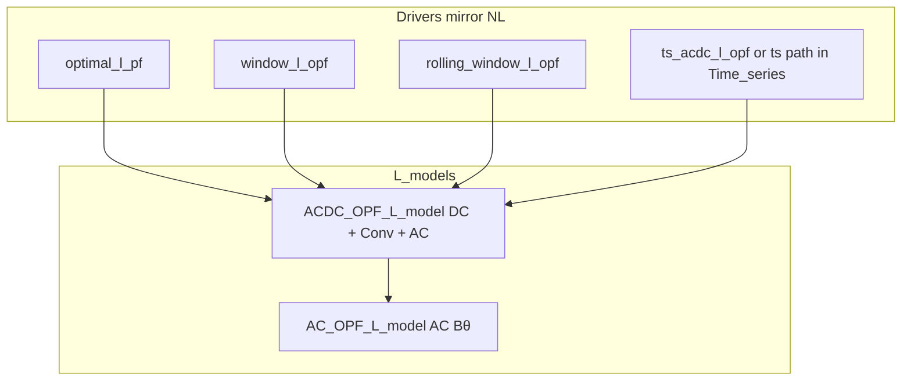
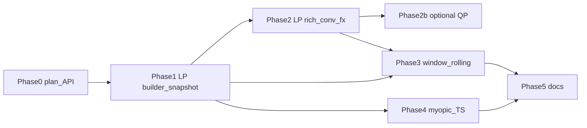

# Linear AC/DC hybrid OPF plan for pyflow_acdc

**Branch:** [`linear_DC`](https://github.com/CITCEA-UPC/pyflow_acdc/tree/linear_DC)  
**Relation:** Sibling to [bess_integration_plan.md](bess_integration_plan.md) (NL + AC-only linear) and [convex_acdc_socp_plan.md](convex_acdc_socp_plan.md) (SOCP/CCP — out of scope here). This plan is **LP first** (optional convex QP later), not SOCP cones.

Living implementation plan for a full linear AC/DC hybrid OPF stack that **mirrors the nonlinear OPF modules** (snapshot, coupled window, rolling, myopic TS). Goal: **adapt existing NL formulations to LP** for computational efficiency — same pyflow_acdc surface and constraints, not a new physics set.

## Locked decisions

| ID | Topic | Decision |
|----|--------|----------|
| H0 | Formulation | **LP first**. Optional **convex QP later** only if needed (e.g. converter loss). **Solver-agnostic** (Pyomo); CI/docs default open-source **HiGHS**. No SOCP/rotated cones for AC power flow (SOCP plan). |
| H1 | Converter | **As rich as NL structure allows under LP**: keep topology modes, AC/DC P/Q link vars, S/P limits via **LP outer approximations** (box / diamond / piecewise), not exact ‖S‖₂. |
| H1b | Converter loss | **LP stage:** constant `a` and/or linear `|P|` aux (optional). **QP stage (later):** P-only epigraph `P_loss ≥ a + c_eff · P_c²` with `U` fixed (NL `(P²+Q²)/U²` → drop Q). MMC / `sqrt` deferred. |
| H2 | DC network | **Linearize NL `DC_constraints`**: replace `V_i(V_i−V_k)G` nodal sum and `PDC_from` / `PDC_to` with a fixed-operating-point linear map (use node `V_ini` as `V_ref`). Keep thermal bounds, DC gens/ren/storage/H₂ / converter injections with **same signs** as NL. |
| H3 | Module mirror | Full operational OPF surface: **snapshot + window + rolling + myopic TS**, AC and DC BESS/H₂ — only what NL already does. |
| H4 | Out of scope | Linear hybrid **TEP**, CSS, SOCP/CCP, BESS sizing; features beyond current NL. |
| H5 | Layout | New builder `pyflow_acdc/L_models/ACDC_OPF_L_model.py`; keep `AC_OPF_L_model.py` as AC-only core reused by hybrid. |
| H6 | Scope rule | Linearize **only** what `NL_models/ACDC_OPF_NL_model.py` already models; no extra devices/constraints. |

## Current baseline (already shipped)

- AC-only LP: `opf_create_l_model_ac` raises on `grid.DCmode` (`L_models/AC_OPF_L_model.py`).
- AC window/rolling: `L_models/window_l_opf.py`.
- NL hybrid reference: `NL_models/ACDC_OPF_NL_model.py` (`DC_*`, `Converter_*`, DC BESS/H₂).

## Linearization principles (NL → LP, then optional QP)

Mirror NL **block structure and variable names** where practical so window parent links / export / `fx_conv` stay familiar.

**AC:** reuse existing Bθ / known-P injection model from `AC_OPF_L_model`.

**DC lines/nodes (H2 — explicit):** from NL `DC_constraints` / line equalities:

- Nodal: `P_sum += pol * V_i * (V_i − V_k) * G * NumLines…` → linearize at `V_ref,i = V_ini` (e.g. `pol * V_ref,i * (V_i − V_k) * G * …`, or equivalent `G·V_ref` conductance form). Document the exact map in code comments / linearization table.
- Lines: NL `PDC_from = (V_f − V_t) * G * V_f * pol` and `PDC_to = (V_t − V_f) * G * V_t * pol` → same fixed-point linearization; keep `PDC_line_loss = PDC_from + PDC_to`.
- Keep `P_known_DC`, ren/gen/storage/H₂/converter/DCDC injections and signs identical to NL.

**Converters (LP first):**

- Keep sets/modes (direct / filter / TF+filter) and vars: `P/Q_conv_s`, `P/Q_conv_c`, `P_conv_DC`, `P_conv_loss`, internal `U`/`θ` **or** reduced equivalents with voltages fixed to `V_ini` for linearity.
- **Loss:** LP-safe first (`a` and/or `b·|P|`); QP epigraph later (H1b).
- Apparent-power limits: LP outer approx (`|P|+|Q| ≤ α S_max` and/or separate `|P|,|Q|` caps)—document gap vs NL ‖S‖₂.
- `fx_conv` / `OPF_fx`: same PDC/PQ/PV fixes as NL on the linear vars.

**BESS/H₂:** AC as today (P-only); DC charge/discharge/SoC and H₂ mass as NL (`PGi_storage_DC`, `PGi_electrolyser_DC`); no DC Q; window parent SoC/H₂ links already side-aware in `NL_models/window_opf.py`.

## Phases

### Phase 0 — Plan + API contract

- [x] Living plan file `plans/linear_acdc_hybrid_plan.md` (this file).
- [x] Lock: LP first → optional QP later; H2 DC `V(V−V)G` / `PDC_from`/`to` linearization; NL-only scope.
- [ ] Document public surface when coding starts: extend `optimal_l_pf` (no more hard AC-only when hybrid ready), `window_l_opf` / `rolling_window_l_opf`, new myopic `ts_acdc_l_opf` (or clearly named twin of `ts_acdc_opf`).
- [ ] Cross-link architecture / `api/L_models`; explicit “not SOCP” note.

### Phase 1 — Hybrid model builder (snapshot, **LP**)

**File:** `L_models/ACDC_OPF_L_model.py`

- `opf_create_l_model_acdc(model, grid, ...)`:
  - If not `DCmode`: delegate to `opf_create_l_model_ac`.
  - If hybrid: AC block + `DC_variables_l` / `DC_constraints_l` + `Converter_variables_l` / `Converter_constraints_l` + storage/H₂ both sides.
- **DC (H2):** implement linearized nodal `V(V−V)G` and `PDC_from` / `PDC_to` (and loss identity) from NL `DC_constraints`.
- Thin converter: topology + power balance + LP S/P boxes; loss LP-simple or deferred.
- `export_acdc_l_model_to_pyflow_acdc` extended for DC nodes/lines/converters (or hybrid export sibling).
- Wire `ACDC_OPF.optimal_l_pf`: call hybrid builder; remove/replace “raise if DCmode” with builder dispatch; keep `SoC_deviation` reject; `opf_obj_l` gains DC gen energy cost if missing.
- Tests: `case39_acdc` / small hybrid `build_only` + optional LP solve; AC-only regression unchanged.

**Exit:** `optimal_l_pf` on AC-only and on a hybrid grid (`build_only`); converter + linearized DC flows export onto grid.

### Phase 2 — Converter richness + `fx_conv` (**still LP**)

- Flesh converter LP to match NL topology branches as far as allowed; document each approximation vs NL.
- Port `fx_conv` behavior for linear models.
- LP loss stand-in if not done in Phase 1 (`a` / `|P|`).
- Tests: fixed PDC/PQ modes; S-limit outer approx smoke; HiGHS LP preferred when available.

**Exit:** Hybrid snapshot with fx modes + documented LP linearization table (incl. DC H2 map).

### Phase 2b — Optional QP (later)

- Only if needed after LP stack works: H1b epigraph `P_loss ≥ a + c P²` (fixed U).
- Do not block window/TS on this.

### Phase 3 — Window + rolling hybrid

- `L_models/window_l_opf.py`: drop DCmode raise; build frames via `opf_create_l_model_acdc(..., window_block=True)`; reuse NL parent `window_soc_constraints` / `window_h2_constraints` / `export_window_opf_results` (already patched for P-only Q).
- Extend `_modify_l_window_parameters` for DC known-P / prices / converter-relevant mutable params.
- Rolling / `future_sight` unchanged at driver level.
- Tests: hybrid `build_only` window + rolling foresight half; PEI optional later (heavy).

**Exit:** `window_l_opf` / `rolling_window_l_opf` accept hybrid grids.

### Phase 4 — Myopic linear TS

- Add linear twin of `ts_acdc_opf` (carry SoC / `mass_H2_prev`, `empty_tank_cycle`, warm-start), using hybrid L builder per hour.
- Soft `SoC_deviation` remains **rejected** (quadratic) unless a later LP-safe surrogate is explicitly added—default: reject like snapshot.
- Tests: short hybrid TS carry; docs in `usage_window_opf` / `api/ts` / `api/L_models`.

**Exit:** Myopic linear hybrid TS path mirrored to NL.

### Phase 5 — Docs, changelog, polish

- `docs/api/L_models.rst`, `usage_window_opf.rst`, architecture note: hybrid LP vs NL vs SOCP.
- CHANGELOG; doc example on small hybrid case (`build_only`).
- Clean unused DC unpacks in AC-only module if still dead.

## Implementation order (dependencies)

## Validation grids

- AC regression: `case39` / existing linear BESS-H₂ tests.
- Hybrid: `case39_acdc`, `Stagg5MATACDC` / `CigreB4_ACDC` as available; PEI only after Phase 3 if runtime allows.

## Explicit non-goals

- No changes to NL builders except shared export helpers if needed.
- No SOCP lifting / CCP / robust (convex plan).
- No linear hybrid TEP in this plan (follow-up if needed).
- No features beyond current NL operational OPF.
