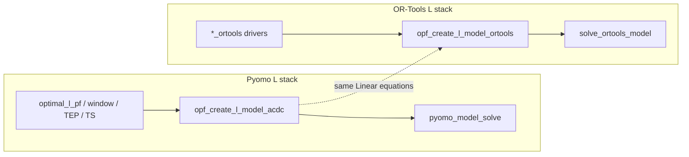

# OR-Tools backend for Pyomo linear models

**Relation:** Sibling to [linear_acdc_hybrid_plan.md](linear_acdc_hybrid_plan.md) (Pyomo L formulation). This plan is a **second solver backend** for the same Linear-model equations, not a new physics set. Array **route** MIP CP-SAT in `Array_OPT.py` stays separate.

Living plan to grow today’s one-off CSS OR-Tools rewrite into a full `ortools_L_*` stack that mirrors Pyomo `L_models` entry points.

**Product rationale:** the dual stack is worth building **only** if an **open** OR-Tools `pywraplp` backend (especially **SCIP**; CBC secondary) is a **better MIP engine than HiGHS** on the target problems (notably AC MP TEP). If bake-offs show HiGHS ≥ SCIP/CBC on gap-vs-time, **stop** — do not maintain a second L formulation for no solver gain. Gurobi remains paper-only and does not justify this plan.

## Locked decisions

| ID | Topic | Decision |
|----|--------|----------|
| O0 | Solver API for L OPF/TEP/CSS | **`ortools.linear_solver.pywraplp`** with `ORTOOLS_LINEAR_SOLVERS` (`GUROBI` / `SCIP` / `CBC`). **Not** CP-SAT for continuous L OPF/TEP. Open capsule default should prefer **SCIP** when available, else CBC — not Gurobi. |
| O0b | Go / no-go | **Mandatory bake-off before Phase 1+ bulk work** (see Phase −1). Proceed with full `ortools_L_*` parity **only if** open OR-Tools MIP (SCIP/CBC) beats or clearly matches HiGHS where it matters (dual bound / gap @ fixed wall time on MP TEP). Phase 0 CSS refactor may still happen as cleanup, but MP/OPF port is gated. |
| O1 | CP-SAT | Remains only for array **path** MIP (`MIP_path_graph_ortools`). Do not migrate L OPF/TEP onto CP-SAT. |
| O2 | Model construction | **Dual builders** (hand-ported equations), not a generic Pyomo→OR-Tools translator. Same Linear-model math as `AC_OPF_L_model.py`. |
| O3 | Public API (v1) | **Parallel `*_ortools` functions** alongside Pyomo drivers. No `backend=` on existing Pyomo APIs yet (may unify later). |
| O4 | Physics sequence | **AC first, then hybrid** — both are in scope. For each capability (snapshot, TEP, window/TS), ship the AC OR-Tools twin before extending that twin with DC/conv/BESS/H₂. Hybrid OR-Tools tracks [linear_acdc_hybrid_plan.md](linear_acdc_hybrid_plan.md) on the Pyomo side (do not invent LP hybrid rules here). |
| O5 | Layout | New modules under `L_models/`. **`AC_L_CSS_ortools` is not a permanent CSS-only stack** — it is the seed of the static TEP OR-Tools driver (renamed / absorbed into `ortools_L_TEP` + shared `ortools_L_model`), driven by the same kind of **grid flags** as Pyomo (`TEP=True`, CT vs EXP/REC candidates, fixed topology for CSS). |
| O6 | Expectation | OR-Tools/SCIP may beat HiGHS on some MILPs; **not** a substitute for Gurobi dual-bound quality on hard MP TEP. |
| O7 | Docs | Modelling equations stay on `docs/api/modelling_*.rst` / `L_models.rst`. This plan may hold internal TODOs; public docs must not. |
| O8 | CSS vs TEP | Mirror Pyomo: array CSS = **static linear TEP on a fixed route** (CT selection), not a separate formulation family. `optimal_l_css_ortools` remains a **thin public alias** that prepares grid flags and calls `linear_transmission_expansion_ortools` (or equivalent). |

## Target module layout

| Module | Role | Mirrors |
|--------|------|---------|
| `L_models/ortools_L_model.py` | Shared builder, objectives, export to grid | `AC_OPF_L_model.py` |
| `L_models/ortools_L_solve.py` | `CreateSolver`, time limit, gap, options, `solver_stats` | Thin twin of `pyomo_model_solve` HiGHS/CBC path |
| `L_models/ortools_L_opf.py` | Snapshot `optimal_l_pf_ortools` | `ACDC_OPF.optimal_l_pf` |
| `L_models/ortools_L_TEP.py` | `linear_transmission_expansion_ortools`, later MP twin | `ACDC_L_TEP.py` — **absorbs today’s CSS OR-Tools entry** |
| `L_models/ortools_L_window.py` | `window_l_opf_ortools`, `rolling_window_l_opf_ortools` | `window_l_opf.py` |
| `Time_series.py` (later) | `ts_acdc_l_opf_ortools` or sibling | `ts_acdc_l_opf` |
| `AC_L_CSS_ortools.py` | Temporary shim → remove after alias lives elsewhere | Seed code moves into `ortools_L_model` + `ortools_L_TEP` |

**CSS alias (keep for `wind_farm_CSS` / tests):** `optimal_l_css_ortools` → set CT/fixed-topology grid state (as today) → call `linear_transmission_expansion_ortools(...)`. Same pattern as Pyomo CSS using `linear_transmission_expansion` instead of a separate CSS builder.

## Current baseline

| Capability | Pyomo | OR-Tools today |
|------------|-------|----------------|
| Snapshot L OPF | `optimal_l_pf` | No |
| Window / rolling | `window_l_opf` / `rolling_window_l_opf` | No |
| Myopic TS | `ts_acdc_l_opf` | No |
| Static TEP / REC / CT | `linear_transmission_expansion` | Partial: CT CSS only (`AC_L_CSS_ortools`, `pywraplp`) |
| MP TEP | `linear_multi_period_transmission_expansion` | No |
| Array route MIP | `MIP_path_graph` | Yes (CP-SAT) — out of this plan’s builder family |

## Physics coverage (both in plan)

| Layer | AC (first) | Hybrid (after matching AC slice) |
|-------|------------|----------------------------------|
| Snapshot OPF | Phase 1a | Phase 1b — DC / conv / BESS / H₂ in builder + export |
| Static TEP | Phase 2a | Phase 2b — hybrid investment / DC–AC expansion when Pyomo L hybrid TEP exists |
| MP TEP | Phase 3a (case24 L is AC) | Phase 3b — only if/when Pyomo MP hybrid L exists |
| Window / TS | Phase 4a | Phase 4b — SoC links on AC+DC devices |

**Ordering rule (O4):** finish **Na** before **Nb** for the same N. AC MP TEP (3a) may proceed before hybrid snapshot (1b) if paper needs demand it — hybrid phases must still be delivered for full parity; they are not optional scope cuts.

Depends on Pyomo hybrid L landing per [linear_acdc_hybrid_plan.md](linear_acdc_hybrid_plan.md); OR-Tools hybrid copies that LP, it does not define new hybrid linearizations.

## Phases

### Phase −1 — Open MIP bake-off (gate)

**Goal:** Prove the product reason for this plan before porting OPF/TEP.

- Export (or solve in-place) the **same** AC MP TEP MILP with **HiGHS** (Pyomo) vs **SCIP** and **CBC** via OR-Tools `pywraplp` (or Pyomo SCIP/CBC if equivalent — same engines).
- Fixed wall-clock budget (e.g. 10–30 min and/or 1–3 h); record BestSol, BestBound, gap, nodes.
- Optional: static TEP / small CSS as sanity, but **MP TEP is the deciding instance**.
- **Pass:** open SCIP (or CBC) materially better than HiGHS on bound and/or gap at the budget → continue Phases 0–4.
- **Fail:** HiGHS wins or ties → **cancel** full OR-Tools L parity; keep HiGHS for open capsule; optional Phase 0 only if CSS cleanup is still desired for other reasons.

**Exit:** Written go/no-go note in this plan (short results table). No Phase 1a+ without **go**.

### Phase 0 — Promote CSS OR-Tools into shared model + static TEP driver

**Goal:** Treat today’s `AC_L_CSS_ortools` as the **first cut of AC static TEP (OR-Tools)**, not a forever-CSS silo. Behaviour for array CSS must stay unchanged.

- Create `ortools_L_solve.py`: solver creation over `ORTOOLS_LINEAR_SOLVERS`, time limit, MIP gap, tee/logging, common `solver_stats` dict shape.
- Create `ortools_L_model.py`: move AC Bθ + gen/ren + **CT investment / envelopes** + objectives + `export_*_ortools` from `AC_L_CSS_ortools.py`. Builder takes **flags** analogous to Pyomo (`TEP=True`, which element types are expandable — CT vs later EXP/REC).
- Create `ortools_L_TEP.py` with **`linear_transmission_expansion_ortools`**: the real entry point (rename/generalize of the CSS solve path).
- **`optimal_l_css_ortools`**: thin wrapper (same signature) that relies on existing grid prep (fixed `active_config`, CT candidates) and calls `linear_transmission_expansion_ortools`. Keep import path stable for `Array_OPT.wind_farm_CSS`.
- Phase 0 builder may only implement **CT** investment (what CSS has today); EXP/REC land in Phase 2a by extending the **same** TEP function + flags — do not keep a second CSS-only model.
- Tests: existing array CSS / sequential OR-Tools tests stay green.
- Docs/ARCHITECTURE: CSS OR-Tools = static L TEP with CT flags; deprecate monolithic file once shim is empty.

**Exit:** `linear_transmission_expansion_ortools` exists; CSS is an alias; shared modules ready for EXP/REC and OPF.

### Phase 1a — AC snapshot OPF (`optimal_l_pf_ortools`)

**Goal:** AC-only linear OPF parity with Pyomo on small cases.

- Extend `ortools_L_model` with non-TEP AC OPF sets: gens, ren curtailment, θ, P balance, line limits — match Linear model on modelling docs.
- Add `ortools_L_opf.py` → `optimal_l_pf_ortools(...)`.
- Export path writes the same grid OPF fields as `export_acdc_l_model_to_pyflow_acdc` (AC subset).
- Smoke: compare obj / key P/θ vs Pyomo+HiGHS within tolerance on a small AC case.

**Exit:** Documented AC-only `optimal_l_pf_ortools`; CI skip-if-no-ortools smoke.

### Phase 1b — Hybrid snapshot OPF

**Goal:** Same `optimal_l_pf_ortools` / builder flags as Pyomo hybrid L (`ACmode` / `DCmode`, converters, BESS, H₂).

- Port DC network LP, converter LP outer approximations, DC/AC storage–H₂ from the Pyomo hybrid L builder once that math is fixed in the hybrid plan.
- Extend `export_*_ortools` for DC/conv/device fields.
- Smoke vs Pyomo hybrid L on a small hybrid case.

**Exit:** Hybrid snapshot OR-Tools matches Pyomo hybrid L scope (no extra devices).

### Phase 2a — AC static TEP (generalize the CSS/TEP driver)

**Goal:** Same `linear_transmission_expansion_ortools` grows from CT-only to general EXP/REC/CT AC MILP (Pyomo static TEP parity).

- Extend `ortools_L_model` flags/constraints for EXP/REC (and any linking already in Pyomo `TEP=True`), still one driver function.
- CSS alias unchanged: fixed topology + CT-only candidates via grid state.
- Numerics: document recommended obj scaling / solver choice (SCIP vs CBC).

**Exit:** Static AC TEP OR-Tools on a small expansion case; array CSS still works through the alias.

### Phase 2b — Hybrid static TEP

**Goal:** OR-Tools twin of Pyomo hybrid linear TEP (DC/conv investment) when that Pyomo path exists.

- Extend builder flags used by `linear_transmission_expansion_ortools`.
- Do not invent DC TEP rules ahead of the hybrid L plan.

**Exit:** Hybrid static TEP OR-Tools parity with Pyomo hybrid L TEP.

### Phase 3a — AC multi-period TEP (paper case24 L lineage)

**Goal:** `linear_multi_period_transmission_expansion_ortools` (AC).

- Port inter-period investment coupling and MP objectives from `ACDC_L_TEP` / NL MP helpers (solver-agnostic parts only).
- Wire `time_limit`, gap, and option dict through `ortools_L_solve` (parallel to paper runner HiGHS options).
- Benchmark: case24 L MP vs HiGHS and Gurobi (gap vs time). Record in plan notes, not public docs hype.
- Optional NL OPF post-process can stay Pyomo/Ipopt regardless of MILP backend.

**Exit:** Paper-style runner can call the OR-Tools MP driver; known limits documented in this plan.

### Phase 3b — Hybrid multi-period TEP

**Goal:** MP hybrid OR-Tools only if/when Pyomo has hybrid MP L TEP.

- Same coupling patterns as 3a with hybrid network/devices from 1b/2b.
- Skip or stub until Pyomo hybrid MP L is real (no gap-filling).

**Exit:** Documented parity or explicit “blocked on Pyomo hybrid MP L.”

### Phase 4a — AC window + myopic TS

**Goal:** `window_l_opf_ortools`, `rolling_window_l_opf_ortools`, `ts_acdc_l_opf_ortools` (AC).

- Multi-block builds + AC SoC/H₂ links.
- Highest coupling complexity; typically after 1a + 2a (and often after 3a if paper-driven).

**Exit:** AC operational L stack OR-Tools parity.

### Phase 4b — Hybrid window + myopic TS

**Goal:** Same drivers with hybrid blocks / DC SoC once 1b exists.

**Exit:** Full operational L OR-Tools parity (AC + hybrid).

## Cross-cutting (every phase)

- **`solver_stats`:** Same keys as Pyomo path where meaningful so `Results_class` / runners stay backend-agnostic.
- **Extras:** `[LINEAR_ARRAY]` documents OR-Tools L backends + SCIP/CBC/Gurobi via `pywraplp`; HiGHS remains Pyomo’s open default.
- **CI:** Optional smoke when `ortools` importable; no hard fail if missing.
- **Import surface:** Optional soft import like today’s `HAS_AC_L_CSS_ORTOOLS`; extend `__all__` as each `*_ortools` lands.
- **No invented physics:** If Pyomo L lacks a constraint, OR-Tools twin must not add it (workspace no-gap-filling).

## Suggested PR sequence

0. Phase −1 bake-off (HiGHS vs SCIP/CBC) → **go/no-go**.
1. Phase 0 — CSS module → `ortools_L_model` + **`linear_transmission_expansion_ortools`** + CSS alias shim (optional if no-go and cleanup still wanted).
2. Phase 1a — AC snapshot + test (**only if go**).
3. Phase 2a — AC static TEP.
4. Phase 3a — AC MP TEP (+ optional paper runner hook).
5. Phase 4a — AC window/TS (timing flexible vs 3a).
6. Phase 1b — hybrid snapshot (when Pyomo hybrid L ready).
7. Phase 2b → 3b → 4b — hybrid TEP / MP / window as Pyomo hybrid L gains those surfaces.

Default order is **all AC (a) before hybrid (b)**, except 3a may run before 1b when the paper AC MP case is the priority; hybrid phases remain committed deliverables in this plan.

## Open items (do not invent; resolve when needed)

- Exact tolerance for Pyomo vs OR-Tools smoke compares.
- Whether MP TEP OR-Tools should appear in Code Ocean runners or remain a local/dev option.
- Unifying to `backend=` later (explicitly deferred; O3).

## Non-goals

- Replacing Pyomo as the primary modelling API.
- Translating arbitrary Pyomo models automatically.
- Expecting OR-Tools to match Gurobi dual bounds on hard MP TEP.
- Moving path MIP off CP-SAT in this plan.
- Building the full dual L stack **without** evidence that open SCIP/CBC beats HiGHS on the deciding MIP (see O0b / Phase −1).
